# Projeto de ToDoList
### Projeto feito com MERN (Mongo + Express + React + NodeJs)

### Esse projeto foi feito para a avaliação final da matéria de laboratório de Engenharia de Software (C214). A ideia é simples, uma lista de tarefa onde o usuário consegue criar, visualizar, atualizar e remover tarefas. Todas as tarefas são armazenadas  em um database no MongoDB.
---
## 🚀 Começando

Primeiramente, é necessário realizar o clone do projeto. 

Se estiver utilizando Windows, siga os seguintes passos:

Crie um novo diretório em uma pasta qualquer
```
$ mkdir ToDolist
```

Entre na pasta criada
```
$ cd ToDolist
```

Clone o repositório utilizando a seguinte linha de comando
```
$ git clone https://github.com/lauracdias/ToDoList.git
```

Faça checkout na branch main, é nela que o código estará mais atualizado
```
$ git checkout main
```

Com o código na versão mais recente (na branch **main**) é possível identificar dois diretórios principais, denominados **front** e **server**. 

O diretório **front** contém a aplicação feita em react (HTML, CSS e JS) e o diretório **server** contém toda a conexão com o banco de dados, definições de rotas e funções que recebem argumentos para realizar os CRUD's.

---

## 📋 Instalação de dependências
O próximo passo para a execução do projeto, é realizar a instalação do **Node.js**, ele pode ser baixado no site oficial: https://nodejs.org/en/download/ e a instalação é bem simples e trivial. Para ter certeza que foi instalado corretamente, digite o seguinte comando: 

```
$ node -v
```
Se o terminal monstrar a versão baixada, signfica que o Node foi instalado com sucesso, caso contrário, repita o passo anterior.

Navegue até o diretório raiz do projeto e execute o seguinte comando para abrir o VSCode
```
$ code .
```

Após isso, é necessário instalar todas as dependências do projeto, é bem simples, já que ele contém um gerenciador de dependências. Como o projeto é separado entre o front-end e o back-end é necessário instalar dependências de ambos, já que são diferentes.

A partir do diretório raiz do projeto execute os seguintes comandos para instalar as dependências do front-end:

```
$ cd front
$ cd todo-list-app
$ npm install
```

O gerenciador de pactoes **npm** indetificará todas as dependências contidas no arquivo **package.json** e instalará todas automaticamente. Depois de instaladas, você verá uma pasta chamada **node_modules** contendo todas as dependências do projeto especificadas no **package.json**.

Após isso, é necessário instalar as dependências do back-end.

Novamente, a partir do diretório raiz do projeto execute os seguintes comandos para instalar as dependências do back-end:
```
$ cd server
$ npm install
```

Assim como no front-end o gerenciador de pactoes **npm** indetificará todas as dependências contidas no arquivo **package.json** e instalará todas automaticamente. Depois de instaladas, você verá uma pasta chamada **node_modules** contendo todas as dependências do projeto especificadas no **package.json**.

---

## Preparando o MongoDB
Após as instalações de todas as depedências do projeto, já é possível executá-lo! Mas antes é necessário um ajuste no back-end, é preciso conectar o projeto com o MongoDB. 

- Para isso, entre no site do <a href="https://www.mongodb.com/">MongoDB</a> e crie uma conta. Com o site logado, crie um novo projeto.

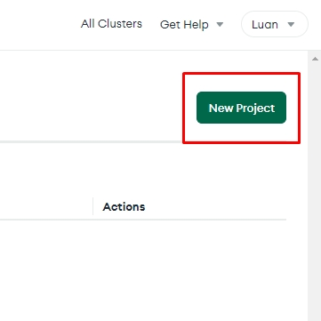

- Dê um nome e clique em continuar e depois em criar.

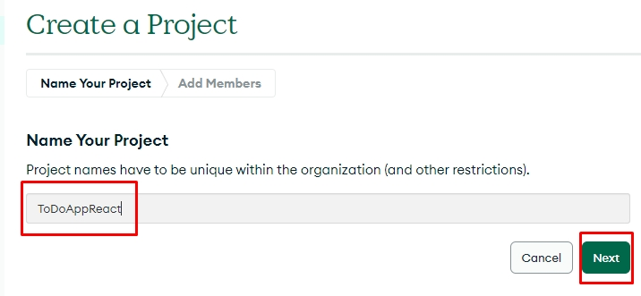

- Crie um novo Database e selecione a opção grátis

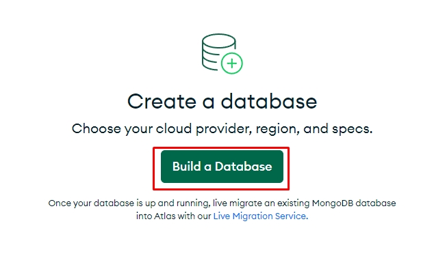

- Clique em criar cluster

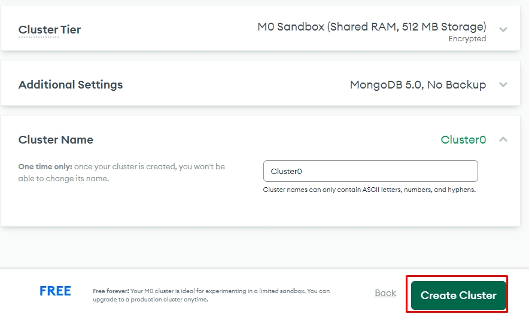

- Coloque um usuário e uma senha e clique em criar usuário, essa autenticação será utilizada no código para conexão do back-end

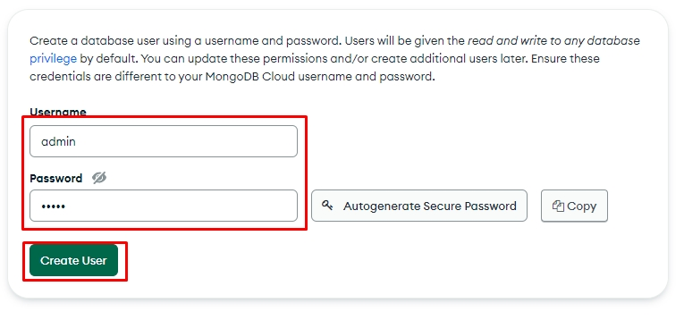

- Na tela de databases clique em connect

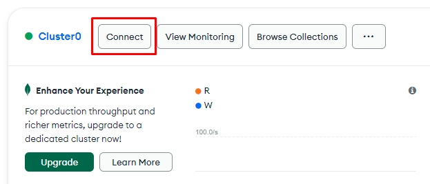

- Selecione a opção indicada na imagem e clieque em "Choose a connection method"

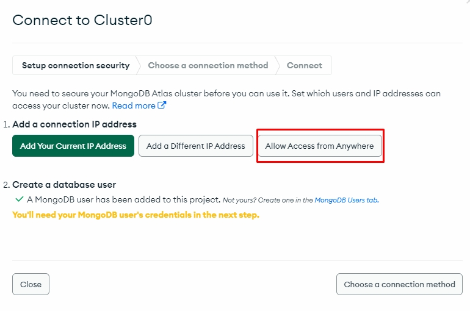

- Selecione a opção de conectar a sua aplicação 

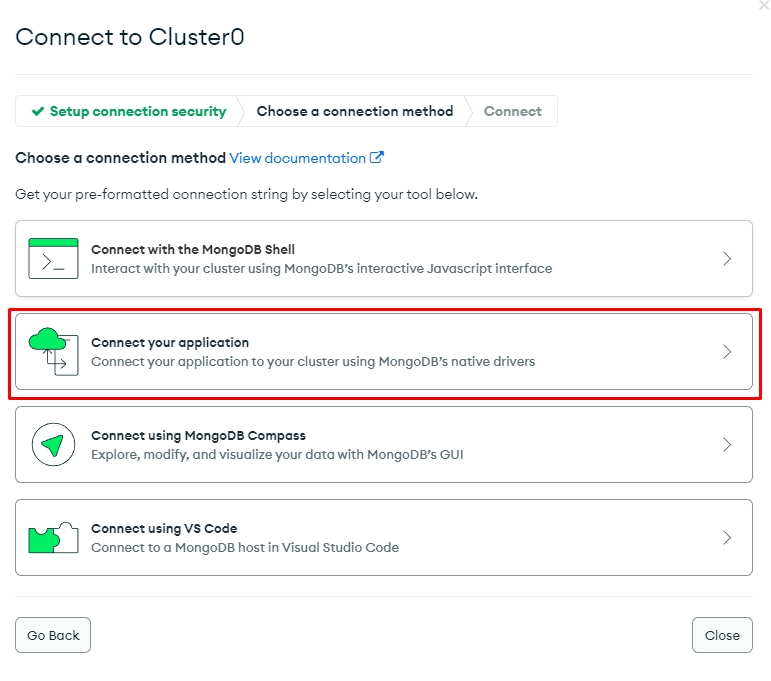

- Copie a autenticação que aparece na tela e vamos colocar no código para a autenticação do nosso back-end, assim como descrito nos próximos passos

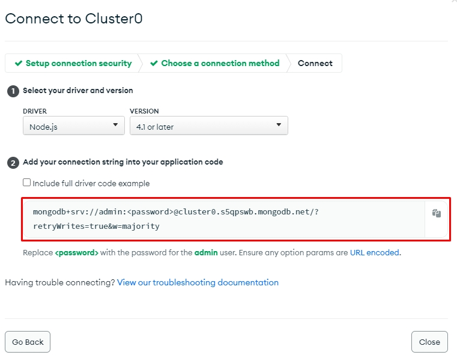

- Na pasta **server** crie um arquivo chamado **.env**, nele vamos colocar a seguinte linha:

```
MONGO_DB = "mongodb+srv://admin:<SUBSTITUA AQUI A SENHA CONFIGURADA NO MONGODB>@cluster0.s5qpswb.mongodb.net/?retryWrites=true&w=majority"
```
O conteudo da string é a autenticação copiada no item anterior e no campo de **password**, substitua pela senha criada no MongDB

o arquivo **.env** de exemplo fica da seguinte forma:

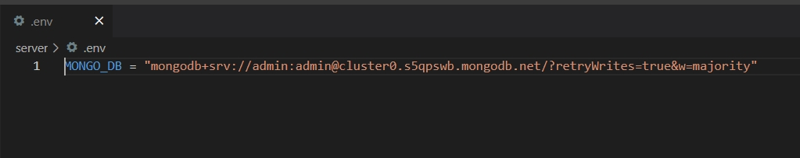


## 🔧 Executando o projeto
Com tudo configurado, finalmente, vamos executar o projeto!
É necessário colocar o front-end e o back-end para rodar!

A partir do diretório raiz do projeto entre na pasta onde o front-end está, utilizando os seguintes comandos:

```
$ cd front
$ cd todo-list-app
```

Dentro desse diretório, coloque o front para abrir com o seguinte comando:
```
$ npm start
```

O seu navegador padrão abrirá e aparecerá a seguinte página:

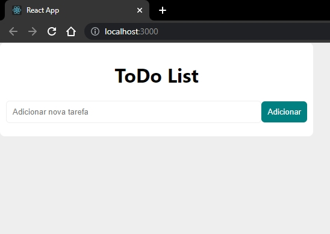
Repare que a nossa aplicação está na porta 3000, como configurado no código.

Com o front já executando, é necessário colocar o back-end para rodar e receber as requisições do front-end.
Para isso, a partir do diretório raiz do projeto, entre na pasta do back-end, com o seguinte comando:

```
$ cd server
```

Para rodar o back-end, utlizamos o seguinte comando:
```
$ npm start
```

Se aparecer os seguintes logs no terminal, significa que o procedimento ocorreu com sucesso e nossa aplicação já está conectada com o database do MongoDB.
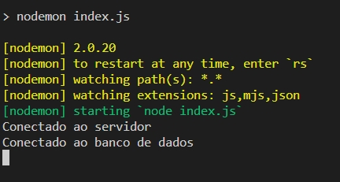

Caso apareça algo diferente, tente reinstalar as dependências e configurar o MongoDB como já explicado nesse **readme**

Chegou a hora de testar na prática o projeto!
Vamos começar adicionando uma tarefa exemplo

Digite o nome da tarefa e pressione **Adicionar**

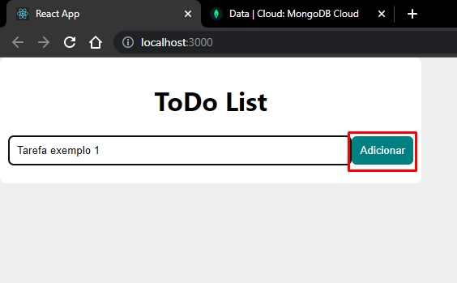

A tarefa aparecerá na lista

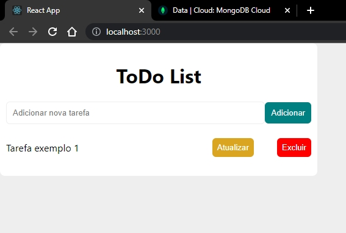

Agora vamos conferir no MongoDB se a tarefa foi adicionada com sucesso, abra seu database e clique em **Browse Collections**, e sua tarefa estará lá. Como na imagem abaixo:

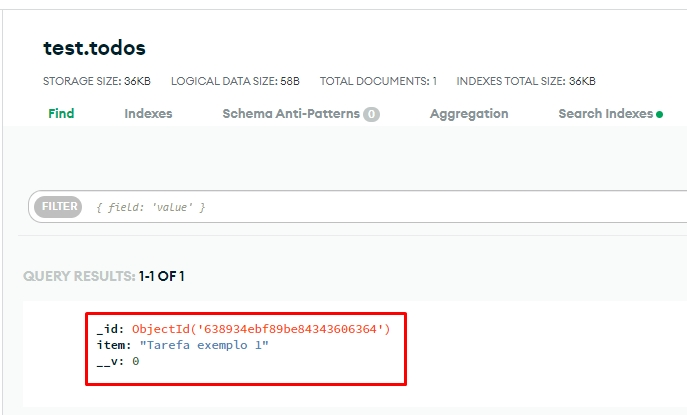

Voltando para o front-end vamos atualizar a tarefa adicionada, clique ao lado do nome, o botão atualizar, troque o nome da tarefa e depois clique em **Atualizar**.

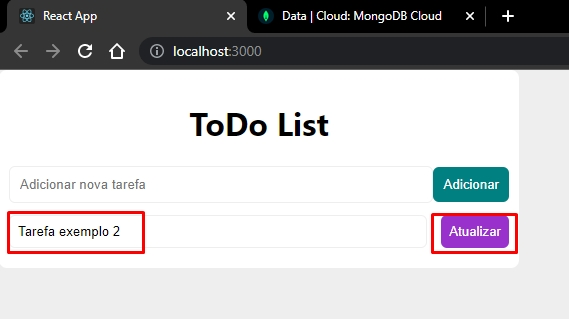

Agora vamos conferir no MongoDB se de fato ela foi atualizada, clique em **REFRESH** para atualizar os dados. 

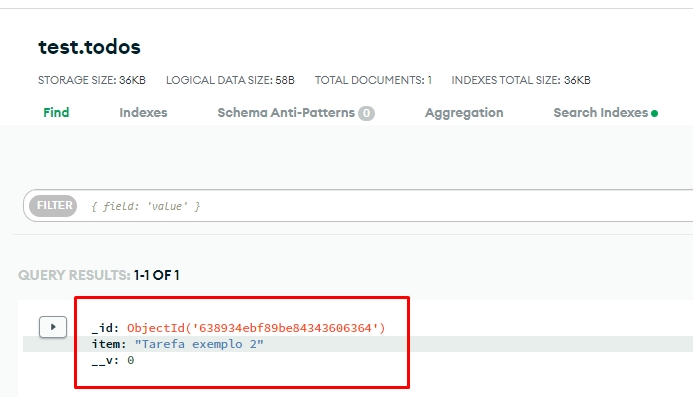

Podemos perceber que a tarefa foi atualizada também do database

Por fim, vamos testar a funcionalidade de excluir a tarefa. Clique no botão **Excluir** da tarefa desejada:

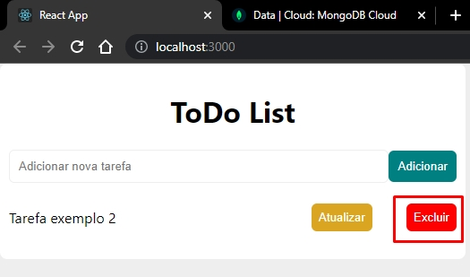

Agora vamos verificar no MongoDB se lá também foi excluido, clique novamente em **REFRESH** para atualizar os dados. 

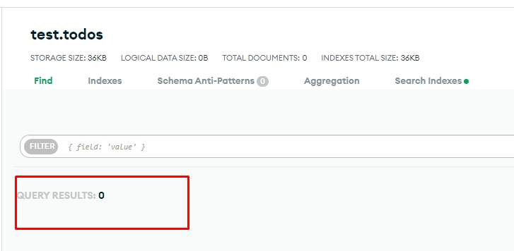

Podemos perceber que a tarefa foi excluida com sucesso!

## ⚙️ Executando os testes

Por fim, para exexutar os testes automatizados é necessário executar os seguintes comandos:
A partir do diretório raiz do projeto, entre na pasta **server**

```
$ cd server
```

E execute o seguinte comando para rodar os testes:

```
$ npm test
```

O **Jest** executará todos os testes da suite, e apresentará os resultados no terminal, dessa maneira: 

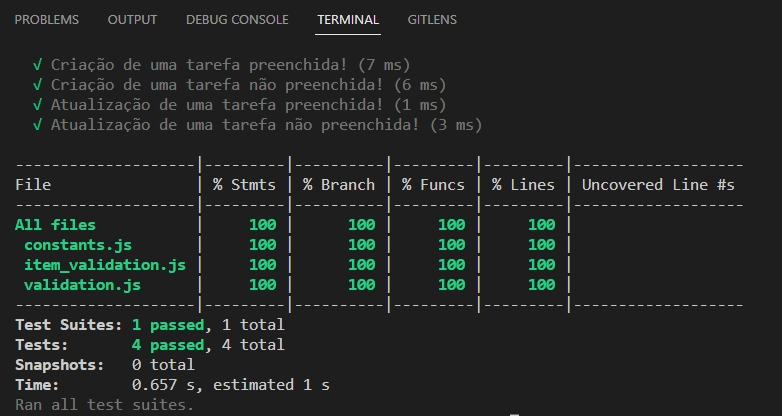


## ✒️ Desenvolvedores

- Laura Cristina Dias - GEC - 1585

- Luan Patrick do Couto Siqueira - GEC - 1655